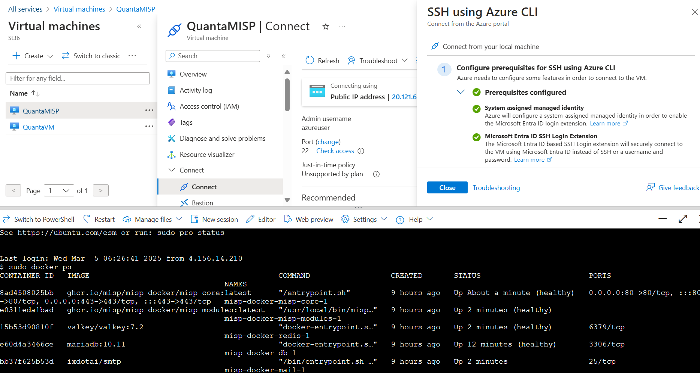
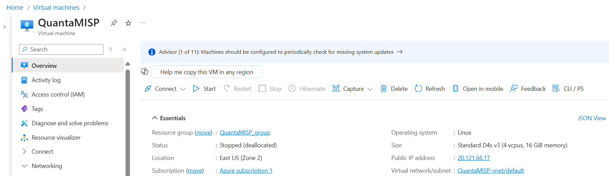
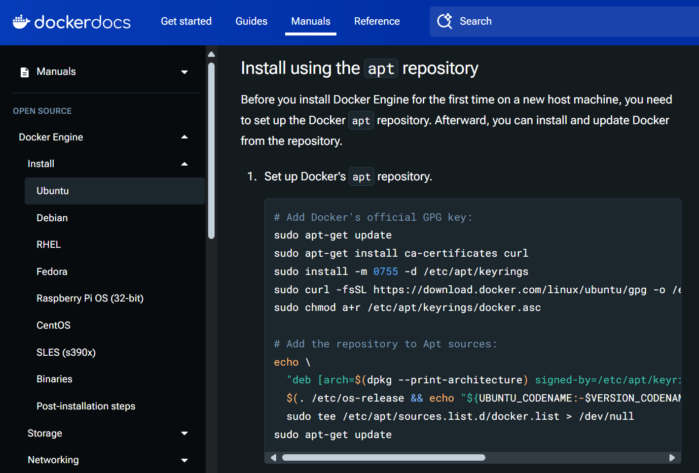
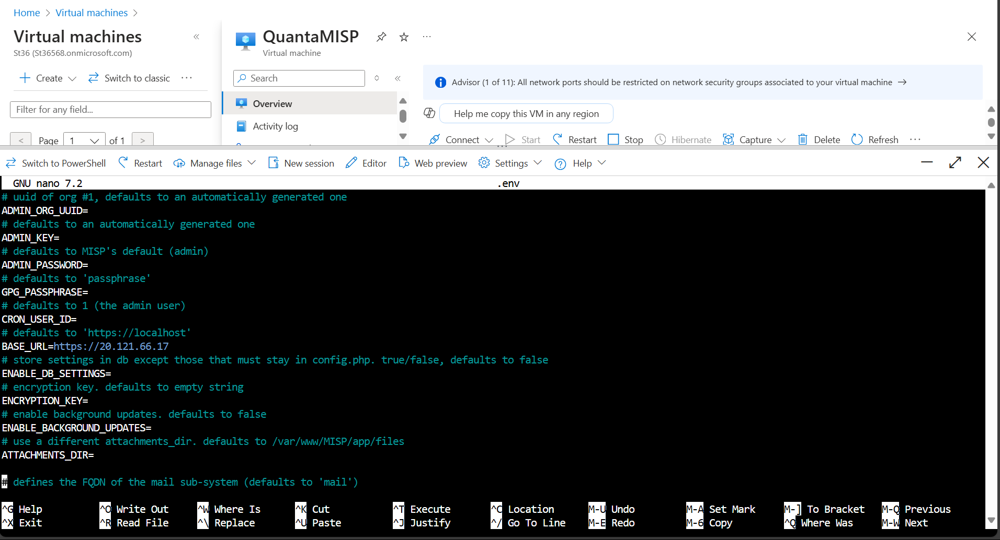
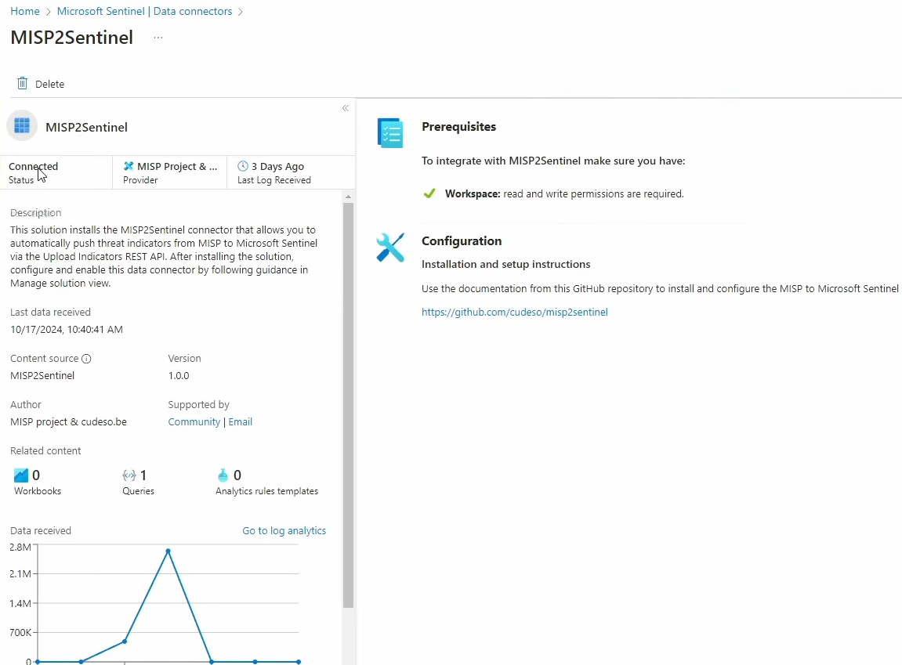

# **Overview**

This project showcases the integration of a Honeypot system with Azure Sentinel and MISP (Malware Information Sharing Platform) to improve threat detection and incident response. By capturing malicious activity through a vulnerable system (Honeypot) and feeding threat intelligence indicators into Azure Sentinel, the project enhances the system's ability to detect and respond to cyber threats in real-time. This setup also uses Docker containers to host MISP and Azure Function Apps for automating data ingestion.

# Implementation Details

## Honeypot Setup
*   **Honeypot Creation:** A Honeypot was set up on a **virtual machine (VM)** running a **RDP** service. This service is intentionally vulnerable and designed to attract malicious actors attempting to exploit RDP vulnerabilities. By simulating a real target, the Honeypot allows for the collection of various attack patterns, login attempts, and other malicious activities.
*   **Event Capture:** The Honeypot records security events, such as login attempts and suspicious network activity. These logs are sent to **Azure Sentinel** through a data connector, where they are used to generate security incidents based on predefined criteria in Sentinel's analytics rules.
*   **Incident Generation:** The security events from the Honeypot are sent to **Sentinel** in real time, where incidents are created based on rules that look for unusual patterns, such as multiple failed login attempts or connections from suspicious IP addresses.

> The main takeaway from this stage is the importance of simulating real-world attacks using a Honeypot to capture valuable threat data for further analysis and detection.

## MISP Setup in Docker

*   **MISP Overview:** MISP is an open-source threat intelligence platform designed to collect, store, and share threat intelligence, such as malicious IP addresses, domains, and file hashes. This stage focuses on setting up MISP to ingest public threat intelligence feeds, which will later be integrated into Azure Sentinel to enrich threat detection.
*   **Dockerized MISP:** To simplify the installation and management process, MISP was deployed using Docker containers. Docker packages the MISP platform in a container, allowing it to run on any system that supports Docker. This eliminates the need for manual configuration and makes the platform more portable and scalable.
*   **Public Threat Feeds:** MISP pulls in threat intelligence data from various public feeds (e.g., threat indicators shared by cybersecurity organizations). This information can include IP addresses, URLs, and network traffic patterns associated with malicious activity.

> By integrating MISP with Docker, this stage ensures that the threat intelligence platform is easily deployable and scalable, with continuous updates from public feeds.

## Connecting MISP to Azure Sentinel

*   **Data Connector Setup:** The goal of this stage is to connect MISP with Azure Sentinel. This is done by setting up a data connector that allows Sentinel to ingest threat intelligence from MISP, enabling Sentinel to use these external indicators to detect potential threats.
*   **API Integration:** The connection is made via MISP's Indicator Uploads API, which facilitates the transfer of threat data from MISP into Sentinel. This step involves authenticating the connection through Azure Active Directory and using an API key for secure communication.
*   **Sentinel Data:** By integrating MISP’s threat intelligence into Sentinel, security analysts gain access to a broader set of indicators of compromise (IOCs). These IOCs can be used to enrich Sentinel’s detection capabilities, flagging suspicious activity tied to known malicious entities (IP addresses, URLs, etc.).

> The key takeaway here is that automation through Azure Function Apps simplifies and ensures the consistency of data flow between MISP and Sentinel, allowing for real-time updates to the threat detection system.

## Testing and Verification

*   **Function App Testing:** Once the **Function App** is deployed, the system is tested by running the function to verify that data is correctly transferred from **MISP** to Azure Sentinel. Logs are reviewed to ensure no errors occur during the data transfer process.
*   **Threat Intelligence in Sentinel:** Once the data is ingested into Sentinel, analysts can query the indicators and view the new threat intelligence. The presence of malicious IPs, URLs, and other indicators enhances Sentinel’s ability to identify threats. Analysts can also set up custom detection rules using these indicators to automate the detection of new threats.
*   **Incident Generation:** After the integration is verified, Sentinel can generate incidents based on the threat intelligence. These incidents are further enriched with additional data from MISP, giving analysts more context for potential threats.

> The main point in this stage is verifying that the entire pipeline—from MISP to Azure Sentinel—works smoothly, with automated updates ensuring that the system is always using the latest threat intelligence.

# Conclusion

This project demonstrates the integration of multiple tools and services to build a robust threat detection and response system. By setting up a Honeypot, integrating MISP for threat intelligence, and automating data ingestion with Azure Function Apps, this solution continuously improves Azure Sentinel's ability to detect and respond to emerging threats.

### Key Learnings

*   The power of integrating external threat intelligence sources like MISP to complement built-in detection rules.
*   The importance of automation in ensuring continuous updates without manual intervention.
*   The flexibility and scalability provided by **Docker containers** and **Azure services** for deploying and managing threat intelligence systems.

## Connect with me:

*   Contact me: fulsundars.omkar@gmail.com
*   Linkedin: [Linkedin]((https://www.linkedin.com/in/omkarfulsundar/)).
